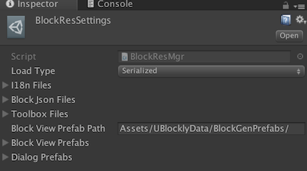

# UBlocky

See the follows for details:

1. http://imagicbell.github.io/unity/2017/10/11/blockly-one.html
2. http://imagicbell.github.io/unity/2017/10/14/blockly-two.html
3. http://imagicbell.github.io/unity/2017/10/22/blockly-three.html
4. http://imagicbell.github.io/unity/2017/10/31/blockly-four.html


Have fun with [2 game demo](https://github.com/imagicbell/ublocklygame).

## HOW TO RUN

1. open **Examples** in Unity.
2. Hit menu **UBlockly/Build Block Prefabs** and wait to finish prefabs building.
3. open scene **UGUIDemo**.
4. Hit play and have fun. 

There offered two UI themes: google blockly style and scratch style. Default is scratch(I prefer~).


To change themes:

1. Drag the prefab **UBlocklyData/Toolboxs/Prefabs/ClassicToolbox** under the scene object **Canvas/Workspace** (Make sure the scene **UGUIDemo** is opened).

2. Delete or hide the other theme prefab **ScratchToolbox**.

3. Attach the **ClassicToolbox** to the component **WorkspaceView** on scene object **Workspace**.

4. Hit play and have a look.

   


## How to add customerized blocks

1. Add json definition for the block. Please follow the format of the built-in blocks under `ublockly/Source/JsonBlocks/`.

   1. If you want to add a block in the existing category, just add the json definition in the existing json files.

   2. The `type` of the block must follow the format: `[category]_nameOfBlock`. 

      e.g. `coroutine_wait_time`, `coroutine` is the name of the category, which is also the name of the json file; `wait_time` is the name of the block.

   3. If you want to add a new category. 

      1. Create a new json file anywhere you want. Then add its reference to the `BlockJsonFiles` in `BlockResSettings`. Of course you can remove a category from it.
      2. If you want the toolbox to show the newly added category, you should add the new category to the toolbox config file named `toolbox_default`. Of course, you can customized the toolbox config by adding your own config file.
      3. Add a translation for the new category name in `en.json`. Or you can create your own i18n file for a new language.

      

2. Interprete the execute code for the newly added block in C#. Please follow the built-in blocks under `ublockly/Source/Script/CodeDB/CSharp`.

   

## How to reset workspace

There are 2 ways to reset the workspace.

1. **Brutal**

```c#
BlocklyUI.DestroyWorkspace();
GameObject.Instantiate(workspacePrefab, GameObject.Find("Canvas").transform);
```

This destroys the `Workspace` gameobject entirely and then re-create a new one. It also reset the logical `workspace`, not only the UI. Just everything.

- *The `workspacePrefab` shall be referenced or loaded by `Resources.Load` or `Assetbundle.Load`...*  

- Also switching scenes can destroy the  `Workspace` gameobject and finish the dispose work automatically, unless you make it undestroyable.

  

2. **Reset block views and toolbox respectively.**

- Stop running code and clean blocks

```c#
BlocklyUI.WorkspaceView.StopRunCode();
BlocklyUI.WorkspaceView.CleanViews();
```

- Reset Toolbox

```c#
BlocklyUI.WorkspaceView.Toolbox.Clean();
BlocklyUI.WorkspaceView.Toolbox.Init(BlocklyUI.WorkspaceView.Workspace, ToolboxConfig.Load());
```


## Some Settings

There are two **Settings** under `ublockly/UserData/Resources`.

1. <a id="blockressettings">**BlockResSettings**</a>

   

   * **Load Type**

     Define which way to load resources. Default **Serialized**.

   * **I18n Files**

     This is where you can add your own language. Remember to check the **selected** checkbox. See [#8](https://github.com/imagicbell/ublockly/issues/8).

   * **Block Json Files**

     This is where you add your customized block json files.

   * **Toolbox Files**

     This is where you can add your customized toolbox config files. e.g. change colors of blocks, select block categories, etc. Remember to check the **selected** checkbox.

   * **Block View Prefab Path**

     This is where the automatically generated block prefabs located. You can change it as your preferred location.

   * **Block View Prefabs**

     This is where to reference the automatically generated block prefabs. Just leave it!

   * **Dialog Prefabs**

     This is where to reference all the dialog prefabs. If you want to add your customized dialog. Drag it here and give a name for loading.

2. **BlockViewSettings**

   This is where to tweak the look of blocks. Currently you may just leave it there.

## Contributors

Greatly appreciate the help by:

[liangxie](https://github.com/liangxieq)

[dtknowlove](https://github.com/dtknowlove)

